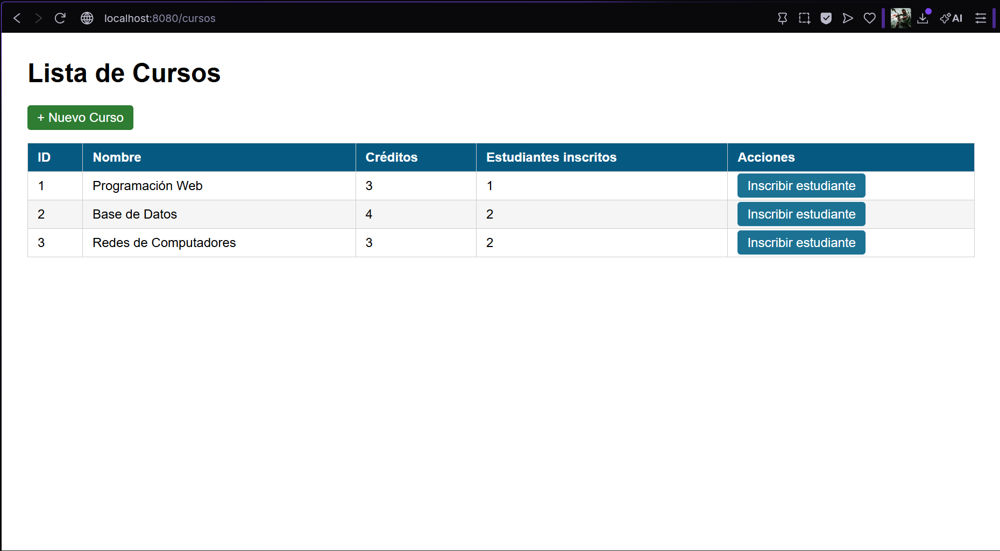
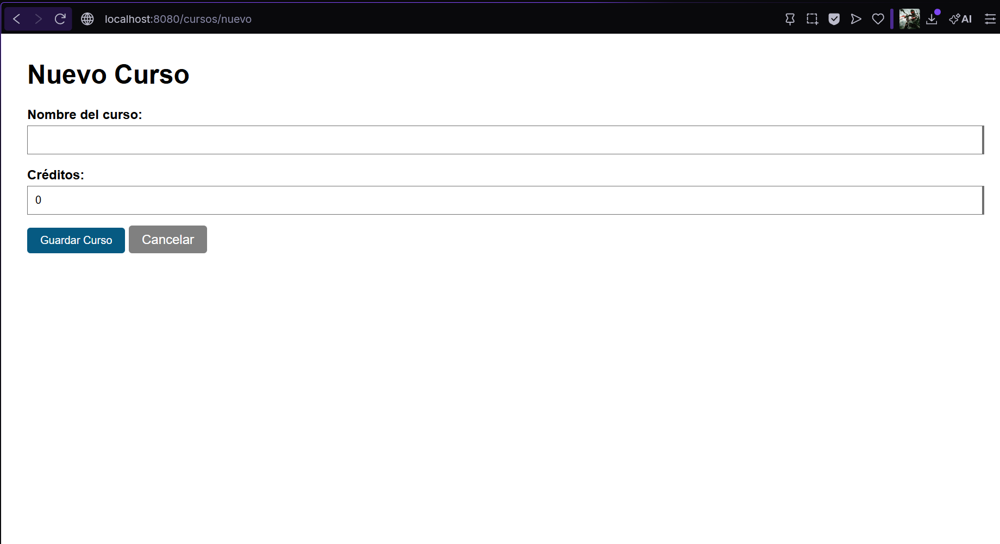
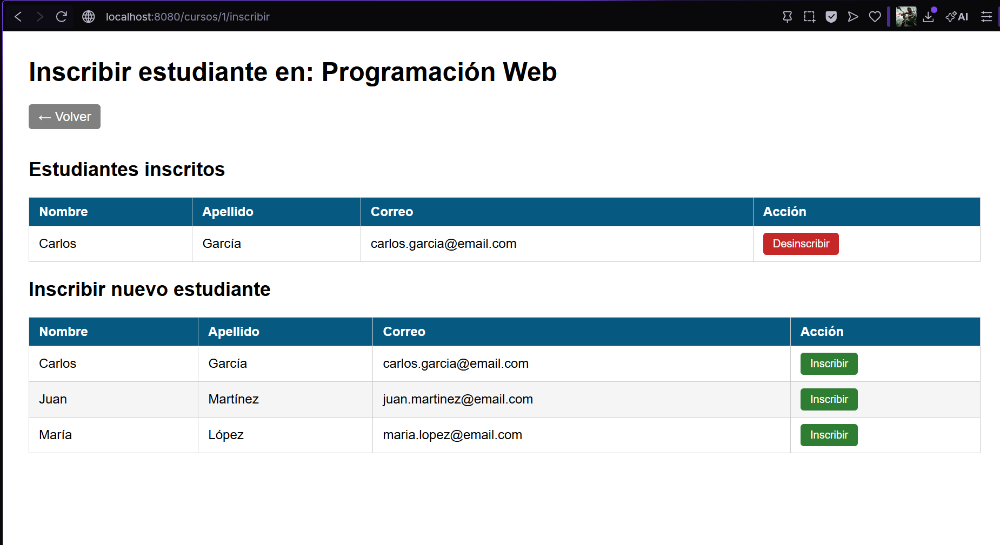
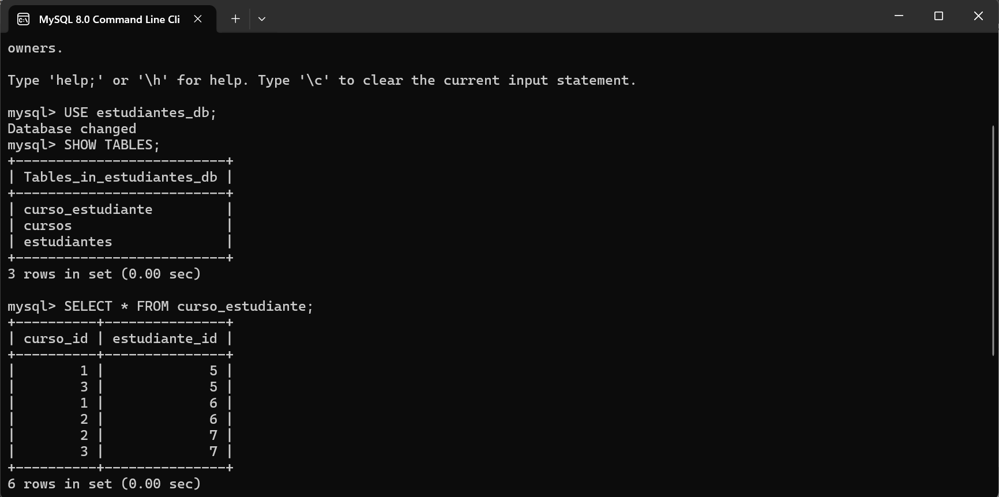

# Gestión de Cursos e Inscripciones - Spring Boot + JPA/Hibernate + MySQL

Aplicación web que extiende el sistema de gestión de estudiantes agregando la entidad Curso
y una relación @ManyToMany bidireccional entre Curso y Estudiante.
Proyecto correspondiente a la Unidad 8 (Post-Contenido 2) de Programación Web - Ingeniería de Sistemas 2026.

## Tecnologías utilizadas

- Java 17
- Spring Boot 3.2.x
- Spring Data JPA / Hibernate
- MySQL 8.x
- Thymeleaf
- Bean Validation (Jakarta Validation)
- Maven

## Relación entre entidades

    Estudiante (N) ←————————→ (M) Curso
                    curso_estudiante
                    ├── curso_id (FK)
                    └── estudiante_id (FK)

- Un estudiante puede estar inscrito en múltiples cursos
- Un curso puede tener múltiples estudiantes inscritos
- La tabla de unión "curso_estudiante" es generada automáticamente por Hibernate
- Curso es el lado propietario de la relación (@JoinTable)
- Estudiante es el lado inverso (mappedBy)

## Estructura del proyecto

    src/main/java/com/universidad/estudiantes/
    ├── model/
    │   ├── Estudiante.java              # Entidad JPA - lado inverso de la relación
    │   └── Curso.java                   # Entidad JPA - lado propietario con @JoinTable
    ├── repository/
    │   ├── EstudianteRepository.java    # Repositorio de estudiantes
    │   └── CursoRepository.java         # Repositorio con consultas JOIN FETCH
    ├── service/
    │   ├── EstudianteService.java       # Servicio de estudiantes
    │   └── CursoService.java            # Servicio con lógica de inscripción
    ├── controller/
    │   ├── EstudianteController.java    # Controlador de estudiantes
    │   └── CursoController.java         # Controlador de cursos e inscripciones
    └── EstudiantesApplication.java

    src/main/resources/
    ├── templates/
    │   ├── estudiantes/
    │   │   ├── lista.html
    │   │   ├── formulario.html
    │   │   └── confirmar-eliminar.html
    │   └── cursos/
    │       ├── lista.html
    │       ├── formulario.html
    │       └── inscribir.html
    └── application.properties

## Configuración de MySQL

**1. Crear la base de datos y el usuario**

    CREATE DATABASE estudiantes_db CHARACTER SET utf8mb4 COLLATE utf8mb4_unicode_ci;
    CREATE USER 'appuser'@'localhost' IDENTIFIED BY 'apppass';
    GRANT ALL PRIVILEGES ON estudiantes_db.* TO 'appuser'@'localhost';
    FLUSH PRIVILEGES;
    EXIT;

**2. Configuración en application.properties**

    spring.datasource.url=jdbc:mysql://localhost:3306/estudiantes_db?useSSL=false&serverTimezone=UTC&allowPublicKeyRetrieval=true
    spring.datasource.username=appuser
    spring.datasource.password=apppass
    spring.datasource.driver-class-name=com.mysql.cj.jdbc.Driver
    spring.jpa.hibernate.ddl-auto=update
    spring.jpa.show-sql=true

> Hibernate creará las tablas automáticamente al arrancar: estudiantes, cursos y curso_estudiante.

## Cómo ejecutar el proyecto

**1. Clonar el repositorio**

    git clone https://github.com/Abrahan07/ProWeb-Remolina-post2-u8.git
    cd ProWeb-Remolina-post2-u8

**2. Asegurarse de que MySQL esté corriendo y la base de datos creada**

**3. Ejecutar la aplicación**

    ./mvnw spring-boot:run

**4. Abrir en el navegador**

    http://localhost:8080/estudiantes   → Gestión de estudiantes
    http://localhost:8080/cursos        → Gestión de cursos e inscripciones

> Requiere Java 17 o superior y MySQL 8.x instalados.

## Endpoints disponibles

| Ruta | Método | Descripción |
|------|--------|-------------|
| `/estudiantes` | GET | Lista todos los estudiantes |
| `/estudiantes/nuevo` | GET | Formulario de nuevo estudiante |
| `/estudiantes/guardar` | POST | Guarda un estudiante |
| `/estudiantes/editar/{id}` | GET | Formulario de edición |
| `/estudiantes/eliminar/{id}` | GET/POST | Confirmar y eliminar estudiante |
| `/cursos` | GET | Lista todos los cursos |
| `/cursos/nuevo` | GET | Formulario de nuevo curso |
| `/cursos/guardar` | POST | Guarda un curso |
| `/cursos/{id}/inscribir` | GET | Vista de inscripción del curso |
| `/cursos/{cursoId}/inscribir/{estudianteId}` | POST | Inscribe un estudiante |
| `/cursos/{cursoId}/desinscribir/{estudianteId}` | POST | Desinscribe un estudiante |

## Optimización N+1 con JOIN FETCH

El repositorio CursoRepository usa consultas JPQL con JOIN FETCH para cargar
los estudiantes de cada curso en una sola consulta, evitando el problema N+1:

    @Query("SELECT c FROM Curso c LEFT JOIN FETCH c.estudiantes")
    List<Curso> findAllConEstudiantes();

## Capturas de pantalla

### Lista de cursos con estudiantes inscritos

### Formulario de nuevo curso

### Vista de inscripción

### Tabla curso_estudiante en MySQL

